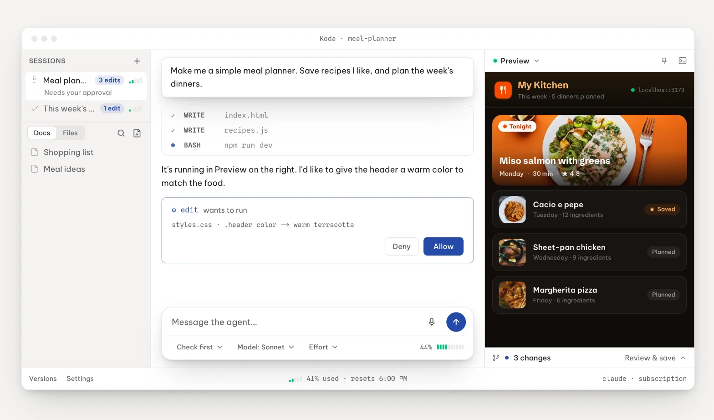
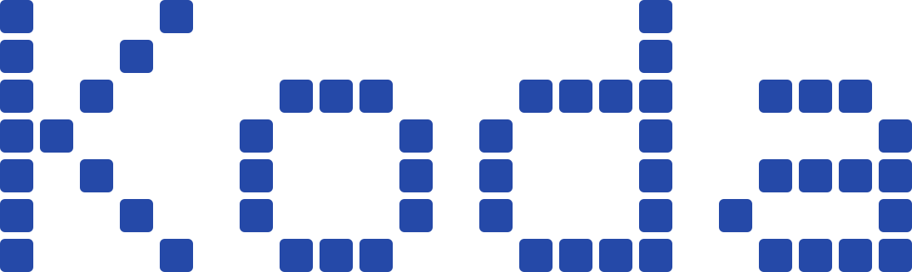

<p align="center">
  
</p>

<p align="center">
  
</p>

<p align="center">
  <b>Build like you know what you're doing.</b><br>
  It runs on the Claude or ChatGPT plan you already pay for, and it keeps track of your usage limits so a cutoff never takes you by surprise. Tell it what you want, and Koda&trade; helps you build the apps and documents you have in mind.
</p>

---

Most tools that build with AI make you bring an API key and pay for every token you use. Koda is built around your subscription instead. It runs on the Claude or ChatGPT plan you already pay for, and it tracks your 5-hour and weekly limits so you always know where you stand. You can use an API key if you want, but Koda is made to get the most out of the flat plan you already have.

To help with what you want to build, Koda comes with the guidelines, skills, and specialists that guide it to the right result, and it shows you each step along the way. Everything it makes stays on your Mac, in an app you already know how to use.

## What makes it good

- **It runs on your own plan.** Koda uses the Claude or ChatGPT subscription you already pay for, and it tracks your 5-hour and weekly limits so a cutoff never surprises you. You can use an API key too, but Koda is built to get the most out of your plan.
- **It asks before it acts.** Koda checks with you before it changes files or runs anything. You choose how much it asks, from step by step to full speed.
- **Nothing can break for good.** Koda saves a point before every change. If something breaks, you go back to the moment it worked in one click.
- **It comes set up.** Koda ships with the rules it follows, plus skills and specialists it can use. You set up none of it, and all of it is yours to change.
- **It remembers your project.** Koda keeps notes as you work, so a new conversation picks up where the last one left off.
- **It's all yours.** What you make runs on your own Mac, with no account to lose. Your projects are plain folders you can take anywhere.

## Get Koda

Head over to [kodahq.io](https://kodahq.io) to download Koda for Mac.

- **Website:** https://kodahq.io
- **Questions:** https://kodahq.io/faq
- **Changelog:** https://kodahq.io/changelog
- **Feedback:** https://kodahq.io/feedback

## How it's built

- **Shell:** Electron with React, TypeScript, and Tailwind, plus Monaco editor, xterm.js, and node-pty.
- **Engine:** the real bundled `claude` and `codex` CLI, interactive and human-steered, never headless.
- **Safety:** a deterministic per-change undo history that stays separate from your own git.
- **Local-first:** the free core runs fully on your machine with your own subscription. Paid cloud (sync, backup, phone control) is optional and separate.

## Develop

```sh
npm install
npm run dev         # launch the app in dev
npm run typecheck
npm run lint
npm test
```

Build a signed distributable with `npm run dist`. It needs Apple Developer signing credentials.

## Repository layout

```
src/main/       Electron main process. Engine adapter, dual-git, safety history, IPC
src/renderer/   Desktop UI (React)
shared/         Types and IPC contracts shared across processes
resources/      The guardrails pack (rules, skills) and bundled assets
scripts/        Build and engine-fetch tooling
```

## Cloud

The paid, Koda-operated backend (relay, sync, backup, phone control) lives in a separate private repo and is not open source. This client runs fully on its own with your Claude or ChatGPT subscription. The cloud is an optional add-on.

Phone control is part of that paid tier, so its code is not in this repo. That covers the phone app and the Mac-side code that serves it. The seam is [`src/main/remote-control.ts`](src/main/remote-control.ts). Here it ships as an inert stub, and Settings shows Remote as unavailable. Nothing is hidden. The paid tier plugs in at that one clearly marked file.

## License

Koda is licensed under the GNU Affero General Public License v3.0. See [LICENSE](LICENSE). You are free to use it, study it, change it, and self-host it. One condition matters most. If you run a changed version as a network service, you have to share your source changes with the people who use it.

Koda&trade; is a trademark of Rashaad Baten. The AGPL covers the source code. It does not give you the right to ship your own product under the Koda name. If you fork Koda, please give your version its own name and branding.

© 2026 Rashaad Baten.
